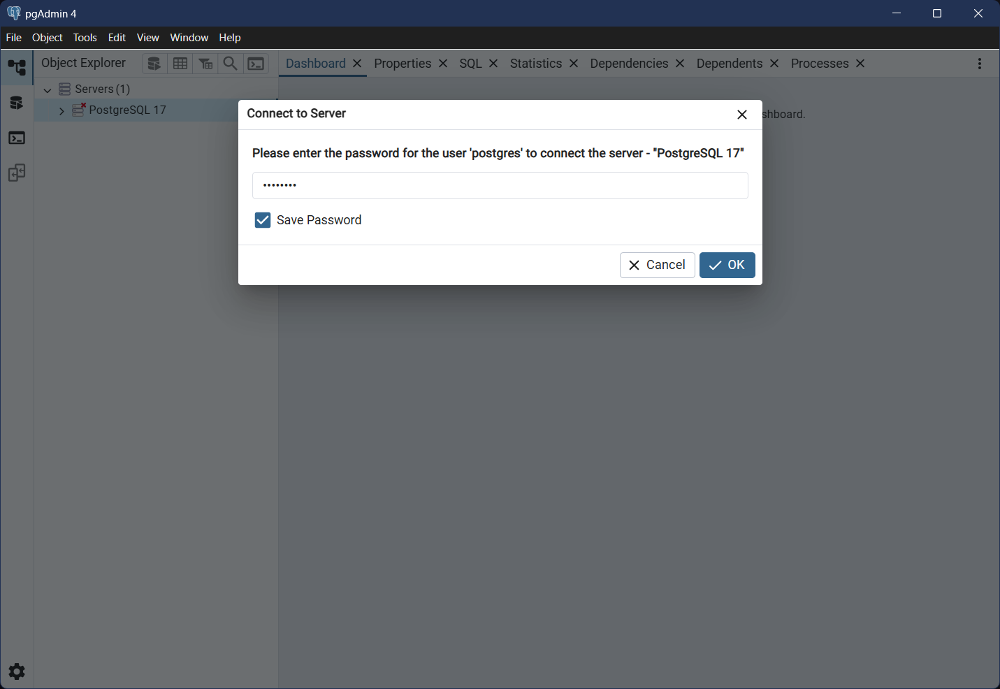
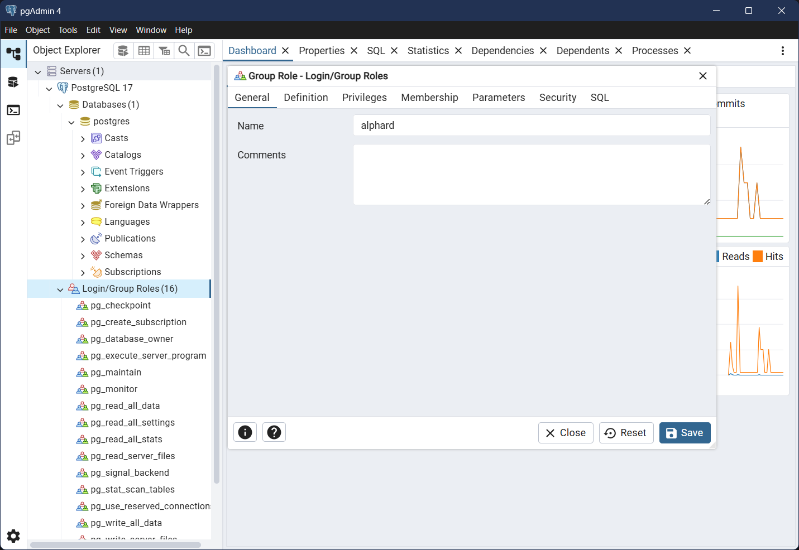
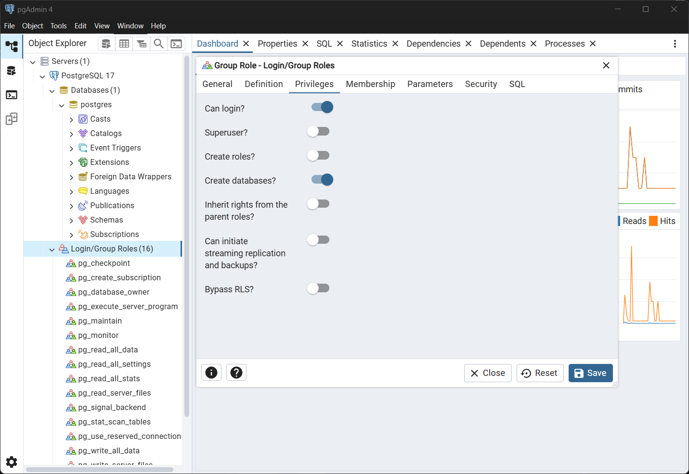
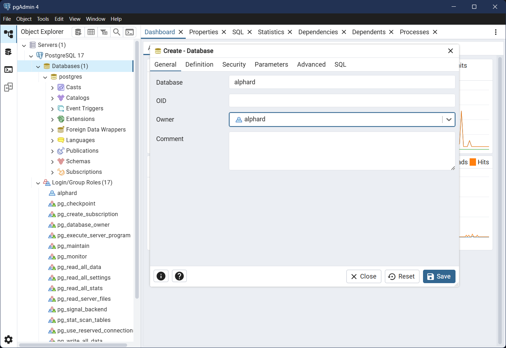

# Alphard

## Prerequisites

* [Python 3.10+](https://www.python.org/downloads/)
* [PostgreSQL 17.6+](https://www.enterprisedb.com/downloads/postgres-postgresql-downloads)
* [Node.js v22.21.1+](https://nodejs.org/en/download)

## Setup (Windows)

0. Install prerequisites

   **Note:** When installing PostgreSQL, remember the password you set for the postgres user.

1. Create and activate a virtual environment

   ```bash
   python -m venv venv
   .\venv\Scripts\activate
   ```

2. Upgrade `pip`

   ```bash
   python -m pip install --upgrade pip
   ```

3. Install dependencies

   ```bash
   pip install -r requirements.txt
   ```

4. Set up the database

   1. Open pgAdmin and connect to your PostgreSQL server

      

   2. Right-click on Login/Group Roles and select Create → Login/Group Role
   3. In the General tab, set name to `alphard`

      

   4. In the Definition tab, set password to `password`
   5. In the Privileges tab, disable *Inherit rights from the parent role?*, and enable *Can login?* and *Create databases?*

      

   6. Click the save button
   7. Right-click on Databases and select Create → Database
   8. Set database and owner both to `alphard`, and click the save button

      

5. Perform database migration

   ```bash
   python manage.py migrate
   ```

6. Install tailwind css dependencies

   ```bash
   python manage.py install
   ```

7. Create an admin user

   ```bash
   python manage.py createsuperuser
   ```

## Setup (Ubuntu)

0. Install system dependencies

   ```bash
   sudo apt update
   sudo apt install python3 python3-venv postgresql nodejs npm gcc build-essential python3-dev libpq-dev
   sudo systemctl enable --now postgresql
   ```

1. Create and activate a virtual environment

   ```bash
   python3 -m venv venv
   source ./venv/bin/activate
   ```

2. Upgrade `pip`

   ```bash
   python3 -m pip install --upgrade pip
   ```

3. Install dependencies

   ```bash
   pip install -r requirements.txt
   ```

4. Set up the database

   1. Connect to your PostgreSQL server

      ```bash
      sudo -u postgres psql
      ```

   2. Execute the following SQL queries to create login role and database

      ```sql
      CREATE ROLE alphard WITH
         LOGIN
         CREATEDB
         NOINHERIT
         PASSWORD 'password';

      CREATE DATABASE alphard WITH
         OWNER = alphard;
      ```

   3. Exit PostgreSQL

      ```sql
      \q
      ```

5. Perform database migration

   ```bash
   python3 manage.py migrate
   ```

6. Install tailwind css

   1. Create `.env` file and add the following line

      ```
      NPM_BIN_PATH=/usr/bin/npm
      ```

   2. Install dependencies

      ```bash
      python3 manage.py install
      ```

7. Create an admin user

   ```bash
   python manage.py createsuperuser
   ```

## Usage

After completing development setup, start the application as follows.

1. Start the tailwind css development server

```bash
python manage.py tailwind start
```

2. In a separate terminal, start the django development server

```bash
python manage.py runserver
```

## Environment Variables

| Variable | Description | Default |
| --- | --- | --- |
| **DEBUG** | Shows detailed error information | True |
| **SECRET_KEY** | Cryptographic signing key | django-insecure-... |
| **ALLOWED_HOSTS** | Hosts allowed to serve the application | [] |
| **DB_NAME** | Database name | alphard |
| **DB_USER** | Database user | alphard |
| **DB_PASSWORD** | Database password | password |
| **DB_HOST** | Database server host | localhost |
| **DB_PORT** | Database server port | 5432 |
| **NPM_BIN_PATH** | Path to npm executable | C:\Program Files\nodejs\npm.cmd |
