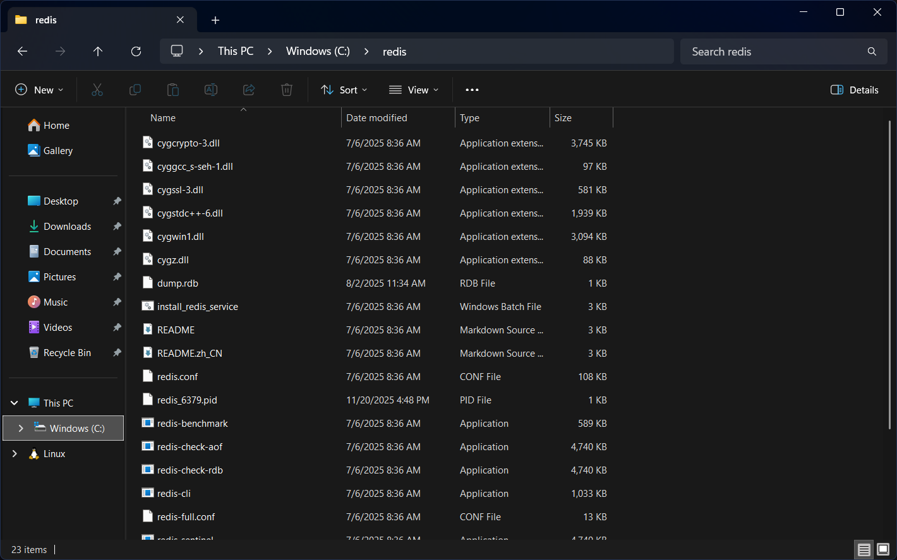
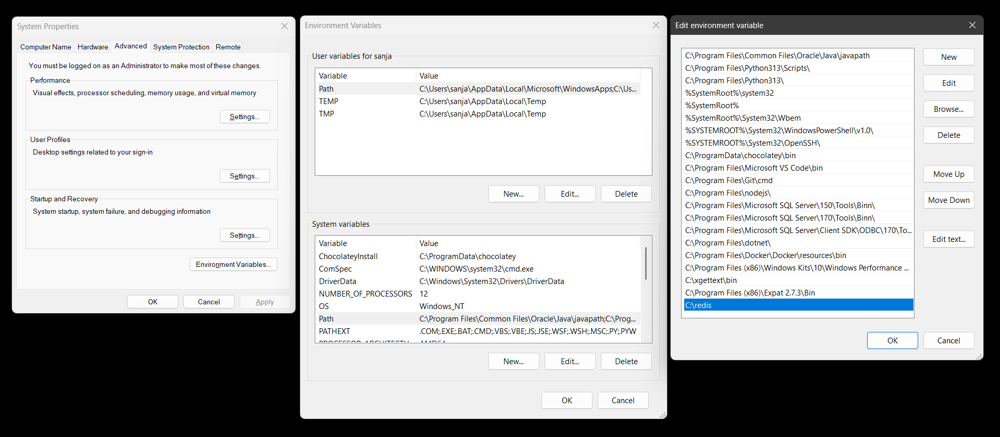

# Alphard

Alphard is a lightweight blogging platform built as a learning project focused on Django, Docker, and modern development tooling. It integrates commonly used libraries and patterns so the application can be deployed with confidence while still remaining approachable for experimentation and study.

The instructions below apply to development setups. If you plan to deploy without Docker, make sure to review the environment variables and relevant Django documentation to adjust the configuration for a production environment. For Docker-based deployments (strongly recommended), refer to `DEPLOYMENT.md`.

The project is provided as open source. If you deploy it, you are responsible for verifying your configuration, ensuring security, and resolving any issues that arise.

## Prerequisites

* [Git](https://gitforwindows.org/)
* [Python 3.10+](https://www.python.org/downloads/)
* [PostgreSQL 17.6+](https://www.enterprisedb.com/downloads/postgres-postgresql-downloads)
* [Node.js v22.21.1+](https://nodejs.org/en/download)
* [Redis v8.2.3+](https://github.com/redis-windows/redis-windows/releases)
* Archiving tool of your choice *(Windows Only)*

## Setup (Windows)

0. Install prerequisites

   **Note 1:** When installing PostgreSQL, remember the password you set for the postgres user.

   **Note 2:** Remember to restart your device after installing all prerequisites.

   1. Install Redis

      **Note 1:** No installer is available for redis, so please follow the steps as given below.

      **Note 2:** Alternatively, you can use WSL2 to install redis, though that's not covered here. If you go this route, you'll to enable WSL and I advise that you install Ubuntu though most articles will cover exactly that. From there, you'll have to follow certain instructions that are included in this guide but for Ubuntu instead of Windows.

      1. Download the zip file

         **Note:** It's recommended to download `Redis-x.x.x-Windows-x64-cygwin-with-Service.zip`.

      2. Navigate to C:\ directory and create a new folder named `redis`
      3. Extract the zip file into the `redis` folder

         

      4. Double-click the `install_redis_service.bat` file
      5. Press Windows Key + R, and in the dialogue box, type `services.msc` and press enter
      6. Locate and right click on Redis
      7. Set Startup Type to Automatic, and click on the start button unless it's disabled
      8. Click ok and close the Services window
      9. Open start, search for, and click on _View advanced system settings_
      10. Click on _Environment Variables..._ button in _System Properties_ window
      11. Under _System variables_, click `Path` variable, and then click the edit button
      12. On _Edit Environment Variable_ window, click New and type `C:\redis`

          

      13. Click OK on each window to close them

      **Note 3:** The steps starting 9 above were technically optional, but realistically you would want to be able to check the data going into redis and such is the easiest to do if you've redis on PATH.

1. Clone repository

   ```bash
   git clone git@github.com:tail-devourer/alphard.git
   cd alphard
   ```

2. Create and activate a virtual environment

   ```bash
   python -m venv venv
   .\venv\Scripts\activate
   ```

3. Upgrade `pip`

   ```bash
   python -m pip install --upgrade pip
   ```

4. Install dependencies

   ```bash
   pip install -r requirements.txt
   ```

5. Set up the database

   1. Open pgAdmin and connect to your PostgreSQL server

      

   2. Right-click on Login/Group Roles and select Create → Login/Group Role
   3. In the General tab, set name to `alphard`

      

   4. In the Definition tab, set password to `password`
   5. In the Privileges tab, disable *Inherit rights from the parent role?*, and enable *Can login?* and *Create databases?*

      

   6. Click the save button
   7. Right-click on Databases and select Create → Database
   8. Set database and owner both to `alphard`, and click the save button

      

6. Perform database migration

   ```bash
   python manage.py migrate
   ```

7. Install tailwind css dependencies

   ```bash
   python manage.py tailwind install
   ```

8. Configure email

   1. Create `.env` file and add the following lines

      ```
      EMAIL_HOST_USER=
      EMAIL_HOST_PASSWORD=
      ```

   2. Go to [Mailtrap](https://mailtrap.io/) and sign up if you don't already have an account
   3. On the dashboard, click _Start Testing_ under _Email Sandbox_
   4. Locate _Credentials_ under My Sandbox -> Integration -> SMTP
   5. Copy the _Username_ and _Password_ values into your `.env` file

9. Create an admin user

   ```bash
   python manage.py createsuperuser
   ```

10. Start the development server(s)

    1. Start the tailwind css development server

       ```bash
       python manage.py tailwind start
       ```

    2. In a separate terminal, start the django development server

       ```bash
       .\venv\Scripts\activate
       python manage.py runserver
       ```

    3. In another terminal, start celery

       ```bash
       .\venv\Scripts\activate
       celery --app=alphard worker --pool=solo --loglevel=info
       ```

    4. Visit [http://localhost:8000](http://localhost:8000) in the browser of your choice

## Setup (Ubuntu)

0. Install system dependencies

   ```bash
   sudo apt update
   sudo apt install -y gcc build-essential libpq-dev python3 python3-venv python3-dev postgresql redis git curl
   curl -fsSL https://deb.nodesource.com/setup_current.x | sudo -E bash -
   sudo apt install -y nodejs
   sudo systemctl enable --now postgresql
   sudo systemctl enable --now redis-server
   ```

1. Clone repository

   ```bash
   git clone git@github.com:tail-devourer/alphard.git
   cd alphard
   ```

2. Create and activate a virtual environment

   ```bash
   python3 -m venv venv
   source ./venv/bin/activate
   ```

3. Upgrade `pip`

   ```bash
   python3 -m pip install --upgrade pip
   ```

4. Install dependencies

   ```bash
   pip install -r requirements.txt
   ```

5. Set up the database

   1. Connect to your PostgreSQL server

      ```bash
      sudo -u postgres psql
      ```

   2. Execute the following SQL queries to create login role and database

      ```sql
      CREATE ROLE alphard WITH
         LOGIN
         CREATEDB
         NOINHERIT
         PASSWORD 'password';

      CREATE DATABASE alphard WITH
         OWNER = alphard;
      ```

   3. Exit PostgreSQL

      ```sql
      \q
      ```

6. Perform database migration

   ```bash
   python3 manage.py migrate
   ```

7. Install tailwind css

   1. Create `.env` file and add the following line

      ```
      NPM_BIN_PATH=/usr/bin/npm
      ```

   2. Install dependencies

      ```bash
      python3 manage.py tailwind install
      ```

8. Configure email

   1. Add the following lines to `.env` file

      ```
      EMAIL_HOST_USER=
      EMAIL_HOST_PASSWORD=
      ```

   2. Go to [Mailtrap](https://mailtrap.io/) and sign up if you don't already have an account
   3. On the dashboard, click _Start Testing_ under _Email Sandbox_
   4. Locate _Credentials_ under My Sandbox -> Integration -> SMTP
   5. Copy the _Username_ and _Password_ values into your `.env` file

9. Create an admin user

   ```bash
   python3 manage.py createsuperuser
   ```

10. Start the development server(s)

    1. Start the tailwind css development server

       ```bash
       python3 manage.py tailwind start
       ```

    2. In a separate terminal, start the django development server

       ```bash
       source ./venv/bin/activate
       python3 manage.py runserver
       ```

    3. In another terminal, start celery

       ```bash
       source ./venv/bin/activate
       celery --app=alphard worker --loglevel=info
       ```

    4. Visit [http://localhost:8000](http://localhost:8000) in the browser of your choice

## Environment Variables

The following environment variables control core application behavior. Defaults are development-oriented. For any production setup outside Docker, update these values accordingly.

| Variable | Description | Default |
| --- | --- | --- |
| **NPM_BIN_PATH** | Path to npm executable | C:\Program Files\nodejs\npm.cmd |
| **DEBUG** | Shows detailed error information | True |
| **SECRET_KEY** | Cryptographic signing key | django-insecure-... |
| **SECRET_KEY_FALLBACKS** | List of previously in use secret keys | [] |
| **ALLOWED_HOSTS** | Hosts allowed to serve the application | [] |
| **DB_NAME** | Database name | alphard |
| **DB_USER** | Database user | alphard |
| **DB_PASSWORD** | Database password | password |
| **DB_HOST** | Database server host | localhost |
| **DB_PORT** | Database server port | 5432 |
| **REDIS_CACHE_URL** | Redis URL for response caching | redis://localhost:6379/0 |
| **REDIS_URL** | Redis URL for rate limiting and misc purposes | redis://localhost:6379/1 |
| **CELERY_BROKER_URL** | URL to message broker | redis://localhost:6379/2 |
| **CELERY_RESULT_BACKEND** | URL to backend that stores the results | redis://localhost:6379/3 |
| **CSRF_COOKIE_SECURE** | Sends CSRF cookies over SSL (Production Only) | True |
| **SESSION_COOKIE_SECURE** | Sends session cookies over SSL (Production Only) | True |
| **EMAIL_HOST** | SMTP server host | sandbox.smtp.mailtrap.io |
| **EMAIL_PORT** | SMTP server port | 587 |
| **EMAIL_USE_TLS** | Use TLS for sending emails | True |
| **EMAIL_USE_SSL** | Use SSL for sending emails | False |
| **EMAIL_HOST_USER** | SMTP username | - |
| **EMAIL_HOST_PASSWORD** | SMTP password | - |
| **DEFAULT_FROM_EMAIL** | Default from address for outgoing emails | webmaster@localhost |
| **ADMINS** | List of admins who will receive emails on 500 errors | [] |
| **SERVER_EMAIL** | Email used to send 500 errors related emails to admins | root@localhost |
