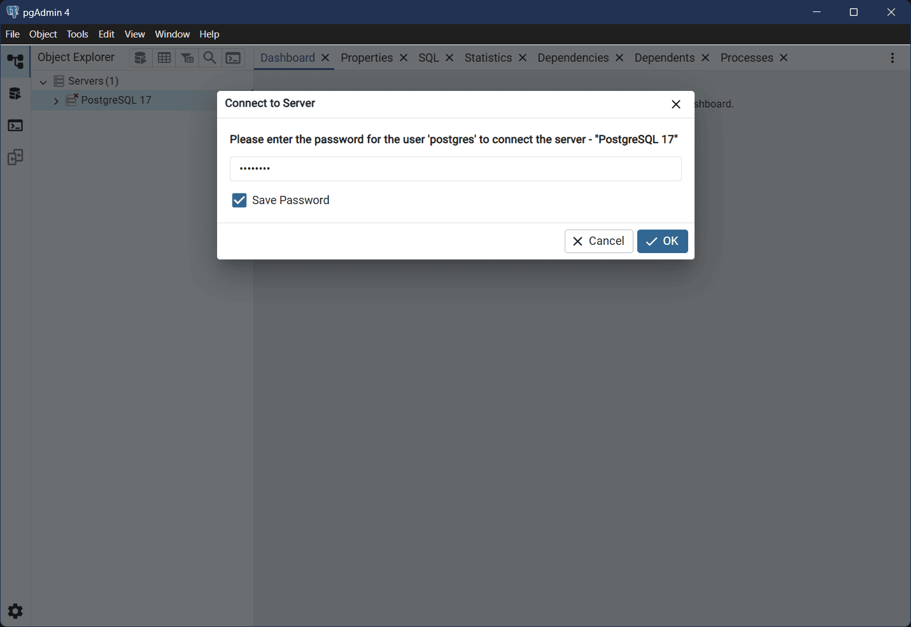
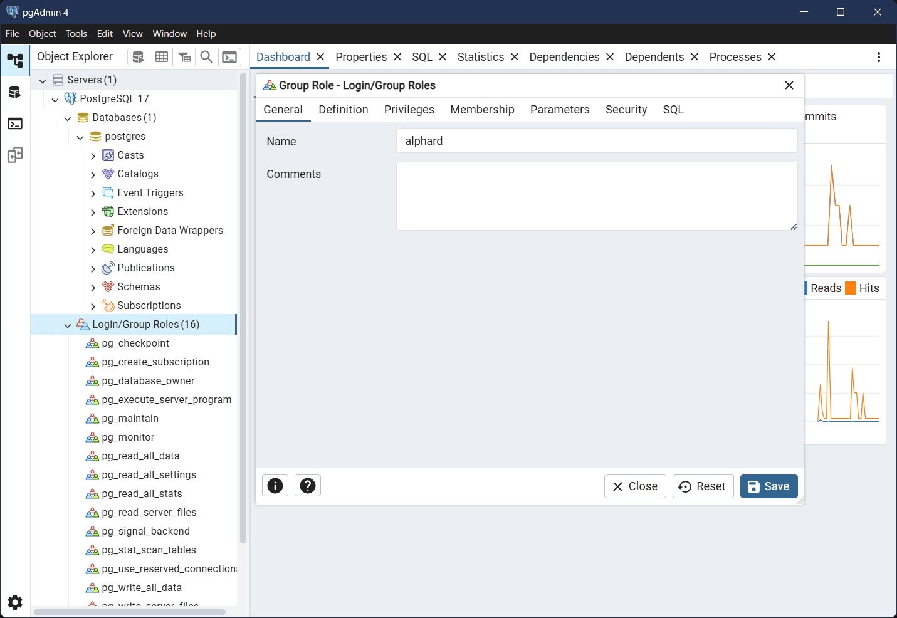
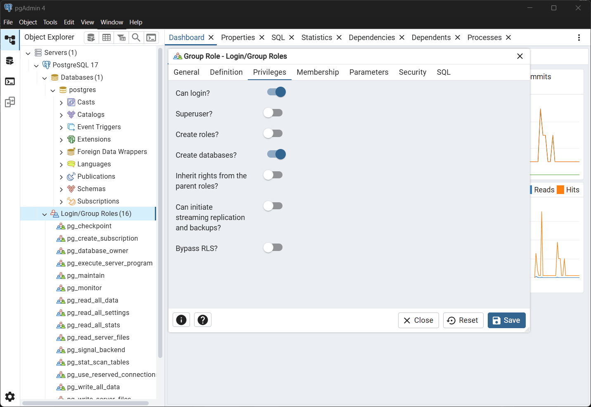
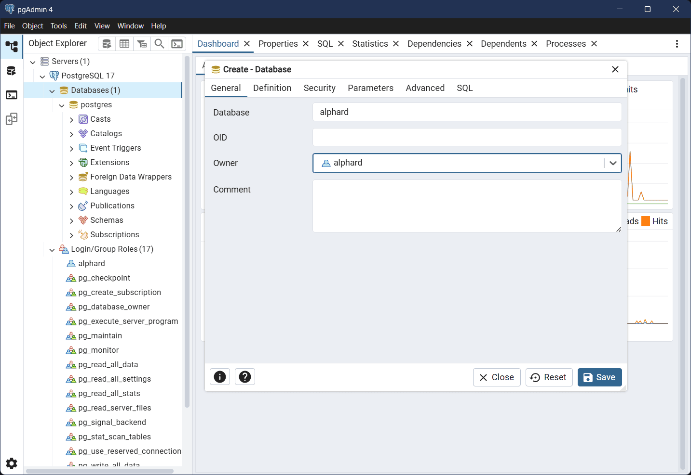

# Alphard

Alphard is a blogging platform built as a learning project focused on Django and Docker. The instructions below apply to development setups. For Docker-based deployments, refer to [DEPLOYMENT.md](DEPLOYMENT.md).

The project is provided as open source. If you deploy it, you are responsible for verifying your configuration, ensuring security, and resolving any issues that arise.

## Prerequisites

- Git
- Python
- Node.js
- PostgreSQL
- Redis

## Setup (Windows)

1. Clone the repository

   ```bash
   git clone https://github.com/tail-devourer/alphard
   cd alphard
   ```

2. Set up the Python environment

   ```bash
   python -m venv venv
   .\venv\Scripts\activate
   python -m pip install --upgrade pip
   pip install -r requirements.dev.txt
   ```

3. Create the `.env` file

   ```env
   SECRET_KEY=django-insecure-changeme
   DEBUG=True
   ```

4. Set up the database

   1. Open pgAdmin and connect to your PostgreSQL server

      

   2. Right-click on _Login/Group Roles_ and select _Create → Login/Group Role_
   3. In the _General_ tab, set the name to `alphard`

      

   4. In the _Definition_ tab, set the password to `password`
   5. In the _Privileges_ tab, disable _Inherit rights from the parent role?_, and enable _Can login?_ and _Create databases?_

      

   6. Click the save button
   7. Right-click on _Databases_ and select _Create → Database_
   8. Set both the database name and owner to `alphard`, then click the save button

      

   9. Append the database password to `.env` file:

      ```env
      DB_PASS=password
      ```

   10. Run database migrations:

       ```bash
       python manage.py migrate
       ```

5. Append the Redis configuration to `.env` file

   ```env
   CACHE_LOCATION=redis://127.0.0.1:6379/0
   REDIS_URL=redis://127.0.0.1:6379/1
   CELERY_BROKER_URL=redis://127.0.0.1:6379/2
   CELERY_RESULT_BACKEND=redis://127.0.0.1:6379/3
   ```

6. Configure email

   1. Sign up at [Mailtrap](https://mailtrap.io/) if you don't already have an account
   2. On the dashboard, click _Start Testing_ under _Email Sandbox_
   3. Locate _Credentials_ under _My Sandbox → Integration → SMTP_
   4. Copy the _Username_ and _Password_ values, then append the following to `.env` file:

      ```env
      EMAIL_HOST=sandbox.smtp.mailtrap.io
      EMAIL_HOST_USER=<username>
      EMAIL_HOST_PASSWORD=<password>
      SERVER_EMAIL=admin@alphard.local
      DEFAULT_FROM_EMAIL=no-reply@alphard.local
      ```

7. Install Tailwind CSS dependencies

   ```bash
   python manage.py tailwind install
   ```

8. Create an admin user

   ```bash
   python manage.py createsuperuser
   ```

9. Start the development servers

   1. In the first terminal, start the Tailwind CSS development server:

      ```bash
      python manage.py tailwind start
      ```

   2. In a second terminal, start the Django development server:

      ```bash
      python manage.py runserver
      ```

   3. In a third terminal, start Celery:

      ```bash
      celery --app=alphard worker --pool=solo --loglevel=info
      ```

   4. Visit [http://127.0.0.1:8000](http://127.0.0.1:8000) to view the site, and [http://127.0.0.1:8000/admin](http://127.0.0.1:8000/admin) to access the admin panel

## Setup (Ubuntu)

1. Install system dependencies

   ```bash
   sudo apt update
   sudo apt install -y gcc build-essential libpq-dev python3 python3-venv python3-dev postgresql redis git curl
   curl -fsSL https://deb.nodesource.com/setup_current.x | sudo -E bash -
   sudo apt install -y nodejs
   sudo systemctl enable --now postgresql
   sudo systemctl enable --now redis-server
   ```

2. Clone the repository

   ```bash
   git clone https://github.com/tail-devourer/alphard
   cd alphard
   ```

3. Set up the Python environment

   ```bash
   python3 -m venv venv
   source ./venv/bin/activate
   python -m pip install --upgrade pip
   pip install -r requirements.dev.txt
   ```

4. Create the `.env` file

   ```env
   SECRET_KEY=django-insecure-changeme
   DEBUG=True
   ```

5. Set up the database

   1. Connect to PostgreSQL:

      ```bash
      sudo -u postgres psql
      ```

   2. Create a login role and database:

      ```sql
      CREATE ROLE alphard WITH
          LOGIN
          CREATEDB
          NOINHERIT
          PASSWORD 'password';

      CREATE DATABASE alphard WITH
          OWNER = alphard;
      ```

   3. Exit PostgreSQL:

      ```sql
      \q
      ```

   4. Append the database password to `.env` file:

      ```env
      DB_PASS=password
      ```

   5. Run database migrations:

      ```bash
      python manage.py migrate
      ```

6. Append the Redis configuration to `.env` file

   ```env
   CACHE_LOCATION=redis://127.0.0.1:6379/0
   REDIS_URL=redis://127.0.0.1:6379/1
   CELERY_BROKER_URL=redis://127.0.0.1:6379/2
   CELERY_RESULT_BACKEND=redis://127.0.0.1:6379/3
   ```

7. Configure email

   1. Sign up at [Mailtrap](https://mailtrap.io/) if you don't already have an account
   2. On the dashboard, click _Start Testing_ under _Email Sandbox_
   3. Locate _Credentials_ under _My Sandbox → Integration → SMTP_
   4. Copy the _Username_ and _Password_ values, then append the following to `.env` file:

      ```env
      EMAIL_HOST=sandbox.smtp.mailtrap.io
      EMAIL_HOST_USER=<username>
      EMAIL_HOST_PASSWORD=<password>
      SERVER_EMAIL=admin@alphard.local
      DEFAULT_FROM_EMAIL=no-reply@alphard.local
      ```

8. Install Tailwind CSS dependencies

   ```bash
   python manage.py tailwind install
   ```

9. Create an admin user

   ```bash
   python manage.py createsuperuser
   ```

10. Start the development servers

    1. In the first terminal, start the Tailwind CSS development server:

       ```bash
       python manage.py tailwind start
       ```

    2. In a second terminal, start the Django development server:

       ```bash
       python manage.py runserver
       ```

    3. In a third terminal, start Celery:

       ```bash
       celery --app=alphard worker --loglevel=info
       ```

    4. Visit [http://127.0.0.1:8000](http://127.0.0.1:8000) to view the site, and [http://127.0.0.1:8000/admin](http://127.0.0.1:8000/admin) to access the admin panel

## Environment Variables

The following environment variables control core application behavior.

| Variable | Description | Default |
| --- | --- | --- |
| **DEBUG** | Enables Django debug mode | `False` |
| **SECRET_KEY** | Django secret key used for signing | - |
| **SECRET_KEY_FALLBACKS** | Comma-separated list of previously used secret keys for rotation | `[]` |
| **ALLOWED_HOSTS** | Comma-separated list of domains allowed to serve the application | `[]` |
| **NPM_BIN_PATH** | Path to the npm executable | `C:\Program Files\nodejs\npm.cmd` (Windows) / `/usr/bin/npm` (macOS/Linux) |
| **SECURE_COOKIES** | Enforces HTTPS-only cookies in production | `True` |
| **DB_NAME** | PostgreSQL database name | `alphard` |
| **DB_USER** | PostgreSQL username | `alphard` |
| **DB_PASS** | PostgreSQL password | - |
| **DB_HOST** | PostgreSQL host | `127.0.0.1` |
| **DB_PORT** | PostgreSQL port | `5432` |
| **CACHE_LOCATION** | Redis URL used for Django's cache backend | `redis://127.0.0.1:6379/0` |
| **REDIS_URL** | Redis URL used for rate limiting | `redis://127.0.0.1:6379/1` |
| **CELERY_BROKER_URL** | Celery message broker URL | `redis://127.0.0.1:6379/2` |
| **CELERY_RESULT_BACKEND** | Celery results backend URL | `redis://127.0.0.1:6379/3` |
| **EMAIL_HOST** | SMTP server hostname | - |
| **EMAIL_PORT** | SMTP server port | `587` |
| **EMAIL_USE_TLS** | Enables TLS for outgoing email connections | `True` |
| **EMAIL_USE_SSL** | Enables SSL for outgoing email connections | `False` |
| **EMAIL_HOST_USER** | SMTP username | - |
| **EMAIL_HOST_PASSWORD** | SMTP password | - |
| **DEFAULT_FROM_EMAIL** | Default sender address for outgoing emails | - |
| **SERVER_EMAIL** | Sender address used for system error emails to admins | - |
| **ADMINS** | Comma-separated list of emails for admin error notifications | `[]` |
| **MANAGERS** | Comma-separated list of emails for manager notifications | `[]` |
